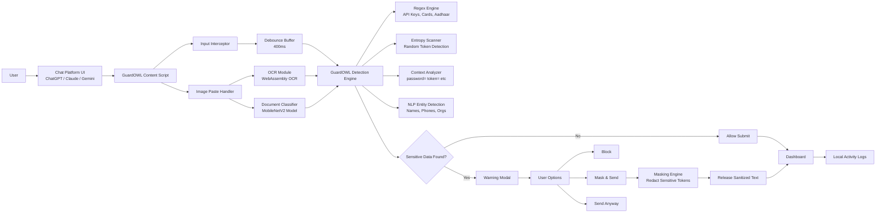
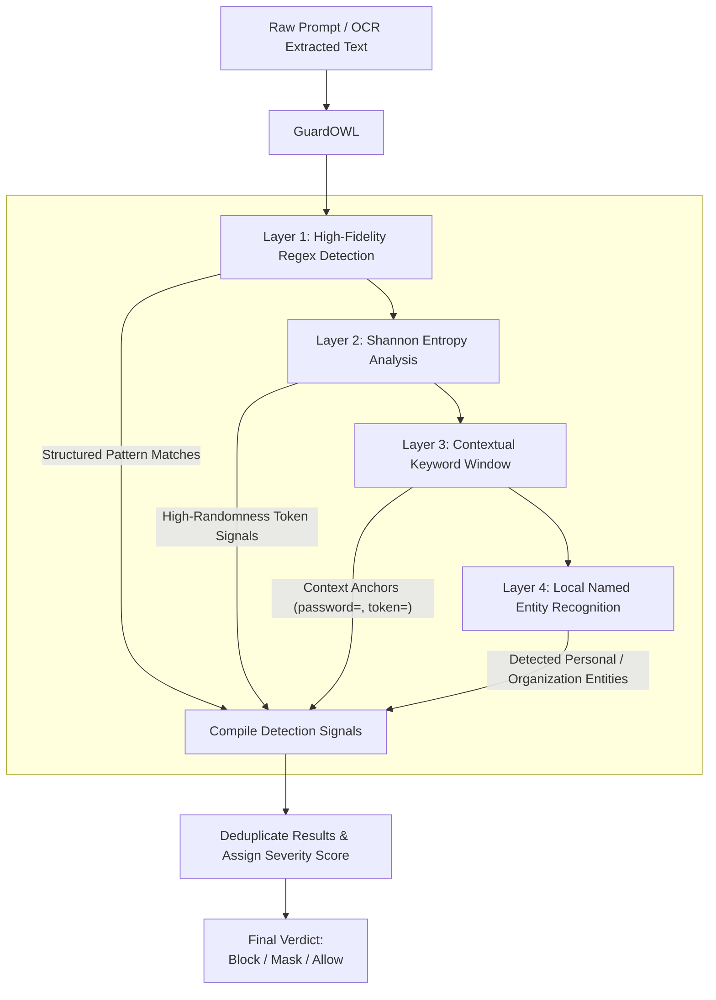

<p align="center">
  
</p>

# GuardOWL
### On-device Watchdog for LLMs
**Observe · Warn · Lock**

---

## What is GuardOWL?

GuardOWL is a Chrome extension that **intercepts sensitive data before it reaches any AI server**.  
It runs 100% on your device. No cloud. No subscription. No data ever leaves your browser.

Built in 24 hours at **Ciphathon 26'** — National Cybersecurity Hackathon, MIT-WPU.

---

## The Problem

### Statement: Browser-Level Sensitive Data Leakage Prevention from LLMs

In 2023, Samsung engineers leaked proprietary source code by pasting it into ChatGPT. Cyberhaven research shows **11% of all employee AI pastes contain confidential data**.  IBM puts the average breach cost at **$4.45M**.

400M+ people use AI tools daily. **Zero of them have on-device DLP protection.**

Enterprise tools like Nightfall AI ($3K–$15K/month) scan your data on *their* servers.  Cyberhaven requires an IT-deployed endpoint agent.  Neither works for individual users, students, developers, or small teams.

**GuardOWL does.**

---

## How It Works

GuardOWL uses a strict 100% on-device architecture engineered to survive modern strict CSPs (Content Security Policies).



###  The 4-Layer Text Pipeline 

Most basic security tools just parse raw text using standard Regex. That creates massive false positives or completely misses modern cryptographic tokens. Instead, GuardOWL pipes every single payload right here through a rigorous 4-Layer waterfall.

1. **Layer 1: High-Fidelity Regex Checksums**: We look for highly structured financial and identity tokens (Aadhaar, SSN, Credit Cards). But we don't just match numbers—we execute mathematical checksum algorithms (like Luhn for cards) to guarantee a 0% false positive rate.
2. **Layer 2: Shannon Entropy Validation**: Zero-day API tokens and cryptographic hashes don't look like standard regex patterns. So, we run a Shannon Entropy probability formula on raw text. If a random character string crosses a mathematical entropy density threshold of 4.5 bits/char, we identify it as a cryptographic secret.
3. **Layer 3: Contextual Slider**: To prevent false-alerting on random IDs, we run a sliding context window. If the engine sees a high-entropy string, it checks the immediate <15 preceding characters for dangerous anchor words like `password=`, `auth_token:`, or `db_endpoint=`.
4. **Layer 4: On-Device Natural Language Processing**: Finally, to catch unstructured data that Regex simply cannot understand, the text is fed into a locally bundled NLP intelligence library (`compromise.min.js`). It reads the text mathematically and extracts Organization Names and hidden phone numbers using Named Entity Recognition.



###  The Image OCR Pipeline
Paste a screenshot of an API key or a photo of a PAN card?
1. **Canvas Preprocessing:** Image is drawn onto an HTML5 canvas where we manipulate the `Uint8ClampedArray` to apply Grayscale scaling, Histogram Contrast Stretching, and Adaptive Binary Thresholding to strip out background noise/watermarks.
2. **Multi-Pass OCR:** Original and preprocessed images are sent to our **Offscreen Document**.
3. **WebAssembly Tesseract:** Google's Tesseract C++ engine runs as a compiled `wasm` binary inside the Offscreen Document isolated from ChatGPT's strict CSP rules, extracting the text mathematically.

If PII is found, a 100% native UI modal appears with choices to **Remove**, **Mask & Send**, or **Send Anyway**.

---

## Detection Coverage

| Category | Patterns |
|---|---|
| API Keys | OpenAI `sk-(proj-)`, Anthropic `sk-ant-`, AWS `AKIA`, GitHub `ghp_`, Google `AIza`, Stripe `sk_live_` |
| Auth Tokens | JWT (`eyJ...`), PEM Private Keys (`-----BEGIN...`) |
| Credentials | Inline passwords (`password=...`), High-entropy hashes |
| Indian PII | Aadhaar (12-digit, zero fake-positives), PAN card (Strict 4th-char status validation) |
| Financial | Credit/debit cards (Luhn-validated) |
| NLP Extraction | Human Names (Density check), Phone Numbers, Organizations |

---

## Supported Platforms

**Primary Targets (AI Chatbots):**
- ChatGPT (chatgpt.com)
- Claude (claude.ai)
- Google Gemini (gemini.google.com)
- Microsoft Copilot (copilot.microsoft.com)
- Bing AI (bing.com)

**Experimental Coverage (Opt-in via Settings):**
- **Gmail (mail.google.com)**: On-the-fly scanning in the email compose box to intercept accidental PII transmission over email.
- **Google Search (www.google.com)**: Inline warning detection directly below the Google Search bar to catch unintentional query leaks.

---

## Installation (Developer Mode)

1. Download and unzip `GuardOWL_Extension.zip` (or clone the repository)
2. Open Chrome → go to `chrome://extensions`
3. Enable **Developer mode** (toggle, top right)
4. Click **Load unpacked**
5. Select the repository folder (or the `dist/` folder for the obfuscated production build)
6. Pin GuardOWL to your toolbar!

---

## Tech Stack

| Layer | Tech |
|---|---|
| Extension Core | Chrome Manifest V3, Vanilla JS |
| Text Engine | Custom Regex + Shannon Entropy + compromise.js (NLP) |
| Image OCR | Tesseract.js v5 (WASM wrapper, fully local bundled) |
| Architecture | Content Script (DOM) ↔ Background (Router) ↔ Offscreen (Sandbox) |
| UI/UX | Native DOM Injection (zero dependency frameworks) |
| Storage | chrome.storage.local/sync (no server, no database) |

---

## File Structure

```
guardowl/
├── manifest.json      MV3 config, CSP wasm-unsafe-eval, permissions
├── detector.js        4-Layer NLP/Regex/Entropy scan engine + masking logic
├── content.js         DOM hooks, Canvas Preprocessing, UI Injection
├── background.js      Service worker, IPC Router, Tesseract initialization check
├── offscreen.js       Headless sandbox running WebAssembly Tesseract OCR
├── popup.html/js/css  Extension dashboard — Live stats, export logs, active tracking
├── options.html/js    Configuration page (Sensitivity, whitelisting, auto-purge)
├── compromise.min.js  Minified natural language processing engine
├── tesseract*         Local WebAssembly OCR binaries (Core, Worker JS)
└── icons/             Extension branding
```

---

## Why On-Device Matters

| | Nightfall AI ($$M) | Cyberhaven (Enterprise) | GuardOWL (Edge DLP) |
|---|---|---|---|
| Detection location | Their cloud server  | Their cloud server  | **Your device sandbox** |
| Sees your true data | Yes | Yes | **Never** |
| Target demographic | InfoSec IT Admins | Enterprise Endpoints | **Individuals & Devs** |
| Installation | Network routing setup | Root-level IT agent | **30 second extension** |

---

## Team Dodos

Built at **Ciphathon 26'** · MIT World Peace University, Pune  
Domain: Privacy-First Applications
